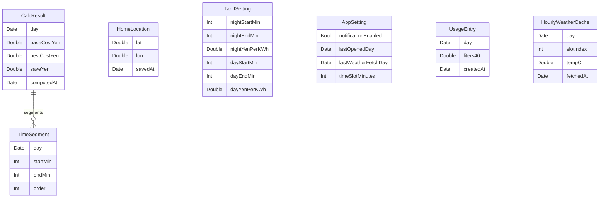

# データ設計書（MVP）

対象：HeatupNavi（iOS 17+ / SwiftData）

目的：端末内に保存するデータの“正”と更新タイミングを固定し、後から壊れにくく・原因追跡しやすい構造にする。

関連：
* `HeatupNavi/Persistence/Models/Models.swift`
* `HeatupNavi/Persistence/Store.swift`
* `HeatupNavi/Persistence/DTOs.swift`
* `HeatupNavi/Services/WeatherClient.swift`

---

## 1. 前提（共通ルール）

### 1.1 日付キー（DayKey）

* 日別データは **当日0:00（ローカル）** に丸めた `Date` をキーにする（`startOfDay`）。
* 1日の境界は0:00固定（MVP）。

### 1.2 1件だけを保証するデータ

以下は「常に1件だけが正」として扱う。

* `HomeLocation`（自宅座標）
* `TariffSetting`（昼夜単価）
* `AppSetting`（アプリ内フラグ/スロット分など）

実装は「保存時に既存を全削除してから挿入」または「更新で1件を更新」で、1件性を担保する。

### 1.3 actor 境界の取り扱い（SwiftData）

* SwiftDataの `@Model` を actor をまたいで渡さない。
* UI/Domain へ返すのは DTO（値型）のみ（`HeatupNavi/Persistence/DTOs.swift`）。
* 永続化の読み書きは `@ModelActor AppModelActor`（`HeatupNavi/Persistence/Store.swift`）に集約する。

---

## 2. 保存データの種類（一覧）

| 種類 | 目的 | “正”か？ | 保存先 |
| --- | --- | --- | --- |
| 自宅位置 | 天気取得の座標 | 正（ユーザー確定値） | `HomeLocation` |
| 電気単価設定 | 昼/夜の価格判定 | 正（ユーザー確定値） | `TariffSetting` |
| アプリ設定 | 通知ON/OFF、最終起動日など | 正（アプリ内状態） | `AppSetting` |
| 使用湯量（日別） | 節約額算出の根拠 | 正（ユーザー入力） | `UsageEntry` |
| 計算結果（日別） | 表示・直近平均計算の根拠 | 派生（再計算可能） | `CalcResult` + `TimeSegment` |
| 天気キャッシュ（当日） | 取得回数抑制、オフライン耐性 | 派生（再取得可能） | `HourlyWeatherCache` |

---

## 3. エンティティ定義（SwiftData @Model）

以下の型はすべて SwiftData の `@Model`（`HeatupNavi/Persistence/Models/Models.swift`）として保存する。

## 3.1 HomeLocation（自宅位置）

用途：WeatherKit取得の座標（初回/再登録のみ更新）。

| 項目 | 型 | 例 | 制約/意味 |
| --- | --- | --- | --- |
| `lat` | `Double` | 35.6 | 緯度 |
| `lon` | `Double` | 139.7 | 経度 |
| `savedAt` | `Date` | 取得日時 | 保存日時 |

更新タイミング：
* Setup の「現在地を取得」
* 設定の「自宅を再登録」

削除/置換：
* 保存時に既存を全削除し、1件に置換する（常に最新が正）。

初期値：
* なし（未登録の場合は Setup へ誘導）

---

## 3.2 TariffSetting（電気単価）

用途：スロットごとの単価配列（`PricePlan`）の生成に利用する。

| 項目 | 型 | 例 | 制約/意味 |
| --- | --- | --- | --- |
| `nightStartMin` | `Int` | 1380 | 夜開始（分、0..1439） |
| `nightEndMin` | `Int` | 420 | 夜終了（分） |
| `nightYenPerKWh` | `Double` | 15.0 | 夜単価（円/kWh） |
| `dayStartMin` | `Int` | 420 | 昼開始（分） |
| `dayEndMin` | `Int` | 1380 | 昼終了（分） |
| `dayYenPerKWh` | `Double` | 30.0 | 昼単価（円/kWh） |

更新タイミング：
* 設定画面での保存

削除/置換：
* 保存時に既存を全削除し、1件に置換する。

初期値（`ensureTariffSetting`）：
* 夜：23:00–7:00、15.0円/kWh
* 昼：7:00–23:00、30.0円/kWh

関係：
* 単価判定は Domain の `PricePlan` が行う（跨ぎ区間対応）。

---

## 3.3 AppSetting（アプリ設定）

用途：通知のON/OFFなど、アプリの振る舞いを決めるフラグを保持する。

| 項目 | 型 | 例 | 制約/意味 |
| --- | --- | --- | --- |
| `notificationEnabled` | `Bool` | true | アプリ内の通知ON/OFF（権限状態とは別） |
| `lastOpenedDay` | `Date` | 今日0:00 | 最終起動日（DayKey） |
| `lastWeatherFetchDay` | `Date?` | 今日0:00 | WeatherKitで取得した最終日（DayKey） |
| `timeSlotMinutes` | `Int` | 30 | 1スロットの分（将来拡張用） |

更新タイミング：
* Home表示（更新含む）：`lastOpenedDay = today`
* WeatherKitで取得したとき：`lastWeatherFetchDay = today`
* 通知のON/OFF：`notificationEnabled` 更新
* （将来）スロット分を変更したとき：`timeSlotMinutes` 更新

削除/置換：
* 基本は1件を更新する（存在しない場合は作成してから更新）。

初期値（`ensureAppSetting`）：
* `notificationEnabled = false`
* `lastOpenedDay = today`
* `lastWeatherFetchDay = nil`
* `timeSlotMinutes = 30`

備考：
* OSの通知権限は `UNUserNotificationCenter` が正。`notificationEnabled` は「アプリ内トグルの意図」を表す。

---

## 3.4 UsageEntry（日別の使用湯量）

用途：節約額算出の根拠（前日分の入力）。

| 項目 | 型 | 例 | 制約/意味 |
| --- | --- | --- | --- |
| `day` | `Date` | 2025-12-19 0:00 | 対象日（DayKey） |
| `liters40` | `Double` | 400 | 40℃相当使用湯量（L） |
| `createdAt` | `Date` | 入力日時 | 入力日時 |

更新タイミング：
* 使用湯量入力画面で保存

削除/置換：
* 同一 `day` は常に1件（保存時に該当日を削除→挿入）。

初期値：
* なし（未入力の場合、表示は「未入力」扱い／計算は標準量で実行可能）

---

## 3.5 CalcResult（日別の計算結果）/ TimeSegment（区間）

用途：
* 当日の計算結果を保存し、直近平均（日→月/年換算）に利用する。
* 表示自体は再計算できるが、履歴として保持する（MVP）。

### CalcResult

| 項目 | 型 | 例 | 制約/意味 |
| --- | --- | --- | --- |
| `day` | `Date` | 今日0:00 | 対象日（DayKey） |
| `baseCostYen` | `Double` | 120 | 基準運用コスト（円） |
| `bestCostYen` | `Double` | 90 | 提案コスト（円） |
| `saveYen` | `Double` | 30 | 節約額（円） |
| `computedAt` | `Date` | 計算日時 | 計算日時 |
| `segments` | `[TimeSegment]` | 最大3件 | 提案区間（子） |

更新タイミング：
* Homeで計算後、**前日分の使用湯量が実入力（actual）である場合** に保存する。

削除/置換：
* 同一 `day` は常に1件（保存時に該当日を削除→挿入）。
* `segments` は `deleteRule: .cascade` により親削除時に自動削除される。

### TimeSegment

| 項目 | 型 | 例 | 制約/意味 |
| --- | --- | --- | --- |
| `day` | `Date` | 今日0:00 | 対象日（DayKey） |
| `startMin` | `Int` | 0 | 開始（分） |
| `endMin` | `Int` | 300 | 終了（分、**endは含まない**） |
| `order` | `Int` | 0 | 表示順（0..2） |
| `result` | `CalcResult?` | 親 | 親への参照（inverse） |

初期値：
* なし（`CalcEngine` の計算結果をそのまま保存）

---

## 3.6 HourlyWeatherCache（当日の時間別気温キャッシュ）

用途：WeatherKit取得を抑制し、取得失敗時のフォールバックに使う。

| 項目 | 型 | 例 | 制約/意味 |
| --- | --- | --- | --- |
| `day` | `Date` | 今日0:00 | 対象日（DayKey） |
| `slotIndex` | `Int` | 0..47 | スロット番号 |
| `tempC` | `Double` | 7.2 | 気温（℃） |
| `fetchedAt` | `Date` | 取得日時 | 取得日時 |

更新タイミング：
* Home表示時に、当日分キャッシュが未作成（不足を含む）の場合に WeatherKit から取得し、当日分を全件保存する。

キャッシュ判定：
* 条件：当日分が `expectedCount = 1440/slotMinutes` 件そろっている（当日中は鮮度で再取得しない）

削除/置換：
* 同一 `day` は保存時に全削除し、当日分を再作成（slotIndexの重複を避ける）。

初期値：
* なし（未取得の場合は「未取得」表示）

---

## 4. 関係（ER）

補足：
* `HomeLocation` / `TariffSetting` / `AppSetting` は「単一レコード」扱いのため ER 上の明示的関係は持たない。

---

## 5. 更新タイミング（機能→データ）

| きっかけ | 更新されるデータ | 主な更新内容 |
| --- | --- | --- |
| 初回起動/起動直後 | AppSetting, TariffSetting | `ensureDefaults` により初期値を作成 |
| Setup：位置取得 | HomeLocation | lat/lon を保存（既存置換） |
| Setup：通知許可（ON） | AppSetting | `notificationEnabled = true` |
| 設定：通知ON/OFF | AppSetting | `notificationEnabled` 更新 |
| 設定：単価保存 | TariffSetting | 昼夜単価を保存（既存置換） |
| 設定：自宅再登録 | HomeLocation | lat/lon を保存（既存置換） |
| 使用湯量：保存 | UsageEntry | 対象日の liters40 を保存（当日キーで置換） |
| Home：表示/更新 | AppSetting | `lastOpenedDay = today` |
| Home：WeatherKit取得 | HourlyWeatherCache, AppSetting | 当日分を保存、`lastWeatherFetchDay = today` |
| Home：計算（前日入力あり） | CalcResult, TimeSegment | 当日結果を保存（置換） |

---

## 6. 削除条件・保持ポリシー

### 6.1 現状（実装）

* `HomeLocation` / `TariffSetting`：保存時に全置換（過去は保持しない）
* `UsageEntry` / `CalcResult` / `HourlyWeatherCache`：同一日キーは置換。**過去日データは削除しない**（保持が増え続ける）

### 6.2 推奨（設計方針）

MVPの安全策として、以下の保持上限を将来追加してよい（要件に応じて調整）。

* `HourlyWeatherCache`：当日＋直近1日程度のみ保持（例：2日分）
* `CalcResult`：直近90日程度（年換算は平均で十分）
* `UsageEntry`：直近90日程度（将来の精度改善に使う場合は延長）

---

## 7. データの“正”（ソース・オブ・トゥルース）

* 正（ユーザーが決める/入力する）
  * `HomeLocation`（自宅座標）
  * `TariffSetting`（電気単価）
  * `UsageEntry`（使用湯量）
  * `AppSetting.notificationEnabled`（アプリ内トグルの意図）
* 派生（再計算・再取得できる）
  * `HourlyWeatherCache`（WeatherKit由来のキャッシュ）
  * `CalcResult` / `TimeSegment`（入力と天気・単価から算出）
* OS側が正
  * 通知権限状態（`UNUserNotificationCenter.notificationSettings()`）

---

## 8. DTO（actor境界越え）

UI/Domain へ渡すのは DTO のみとする。

* `HomeLocationDTO`
* `TariffSettingDTO`
* `AppSettingDTO`
* `UsageEntryDTO`
* `CalcResultDTO` / `TimeSegmentDTO`
* `HourlyWeatherDTO`

DTOの目的：
* `@Model` を MainActor へ持ち出さない（Swift 6 / SwiftDataの並行安全性を守る）
* テストしやすい値型として扱う
