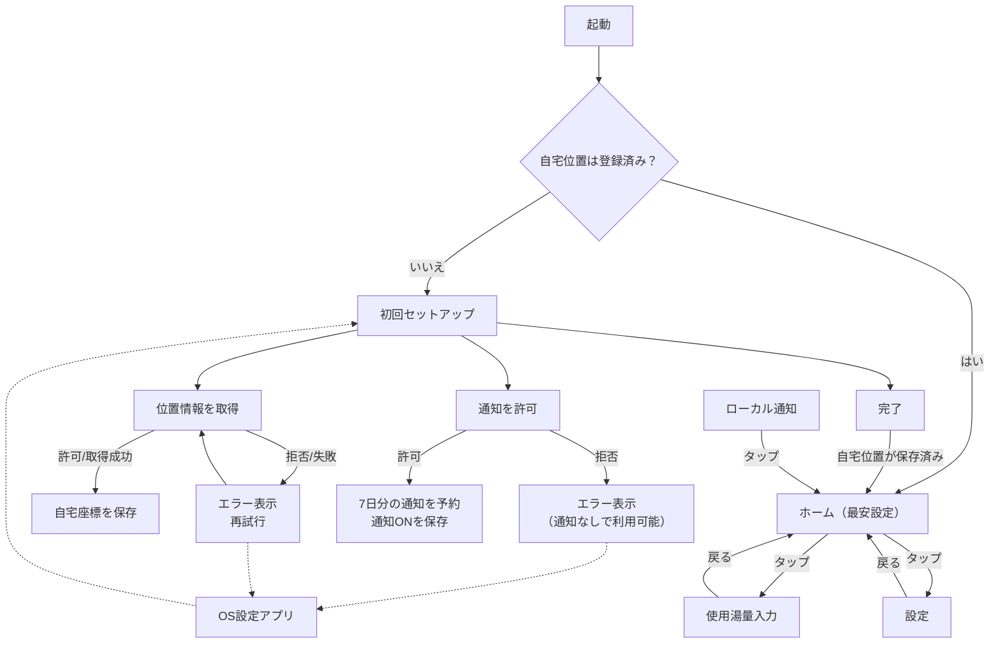

# 画面遷移図（MVP）

対象：HeatupNavi（iOS 17+）

目的：アプリ全体の導線（分岐・戻る・例外ルート）を一枚で把握できるようにする。

---

## 1. 遷移図（Mermaid）

---

## 2. 分岐条件（入口）

* 起動直後の分岐
  * 自宅位置が未登録 → 初回セットアップへ
  * 自宅位置が登録済み → ホームへ
* 通知タップ時
  * 常にホームへ直行（途中画面が開いていても、ホームへ戻す）

---

## 3. 戻る動作

* ホーム →（使用湯量入力/設定）→ **戻るでホームへ**
* 初回セットアップはルート画面扱い（戻る遷移なし）

---

## 4. 例外ルート（権限拒否など）

### 4.1 位置情報

* 拒否/失敗：セットアップ画面内でエラー表示し、再試行導線を出す
* OS設定で許可状態を変更したい場合：設定アプリへ誘導（※ボタン追加は検討）

### 4.2 通知

* 拒否：セットアップ画面内でエラー表示
* 通知は拒否されてもアプリ利用は可能（通知予約は行わない）
* OS設定で許可状態を変更したい場合：設定アプリへ誘導（※ボタン追加は検討）
* 実装差分メモ：現状のセットアップ画面は「通知が許可済みでないと完了できない」挙動になっているため、仕様に合わせる場合は活性条件の調整が必要

---

## 5. 補足（実装メモ）

* 画面の実体
  * Setup：`HeatupNavi/UI/Views/SetupView.swift`
  * Home：`HeatupNavi/UI/Views/HomeView.swift`
  * Usage：`HeatupNavi/UI/Views/UsageInputView.swift`
  * Settings：`HeatupNavi/UI/Views/SettingsView.swift`
* ルーティング（通知タップ含む）
  * `HeatupNavi/App/RootView.swift`
  * `HeatupNavi/App/AppEntry.swift`
